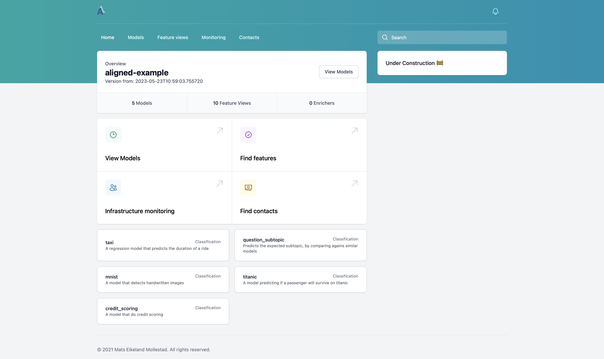

# Aligned Examples

This repo contains different examples of how to use the `aligned` package.

## Join our Discord
We have set up a [Discord](https://discord.gg/R7qB2tfxjs) where you can ask more questions and get help.
[Join our community](https://discord.gg/R7qB2tfxjs)

## Why should you use Aligned?

Aligned's goal is to reduce the technical debt in ML Systems. 

Aligned tries to address visibility debt. Such debt makes it unclear how your system behaves - Who writes and reads the data?
Aligned also fixes technical debt like dead code, as Aligned can prune dead features. This functionality is possible by collecting data lineage of the whole system.

And much more! Read more about [debt in ML systems Sculley et al. [2015]](https://papers.nips.cc/paper/2015/file/86df7dcfd896fcaf2674f757a2463eba-Paper.pdf).

Aligned fits low to medium-sized companies. Therefore, Aligned only supports processing in Pandas and Polars, while Spark and Flink will be added in the future!

### Aligned vs. Feature Stores
Aligned can look similar to a feature store like Feast and Tecton.
Compared to Feast, it may look like Aligned only offers a way to centralize pre-processing and transformations. However, there is more.

To clarify, will it help to define any ML application as $f(X) \Rightarrow \hat y$. 

Feast and Tecton mainly focus on the input features to our model $f(X)$. Therefore, they improve the quality of the $X$, which Aligned also does with point-in-time joins, etc.

However, Aligned also focuses on tracking the relationship between $X$ and $\hat y$. Therefore, Aligned makes it possible to monitor real-time model performance, create active learning datasets, and more.

## Aligned Minimal Example

To view how the whole infrastructure can be started with minimal code. View the [Aligned Minimal Example repo](https://github.com/MatsMoll/aligned-example-minimal).
Here will the features in this repo be used as the source of truth (aka. the `feature-store.json` file), but only the infrastructure will be defined there.

## Whats included here
There are four different projects:
- New York taxi model - which predicts the duration of a trip.
- Titanic model - which predicts if a passenger survives.
- Question similarity model - Predicts which topic a question belongs to using text embeddings and a vector database.
- MNIST model - *beta feature* how to load raw data from an image model.
- Credit Scoring - Almost the same as [Feast's Credit Scoring example](https://github.com/feast-dev/feast-aws-credit-scoring-tutorial/tree/main)

## Start the whole infrastructure
Aligned can do a lot of different things. Therefore, to make it simple to explore different parts of the stack, a 'docker-compose.yaml` file has been created.

This will setup the following infrastructure:
- A data catalog to explore models, features, data lineage, and more - [Open the data catalog](http://localhost:8002)
- A stream worker that processes data submitted through a Redis stream - Exposes metrics on port 8000
- A features server that serves fresh features - [Open the feature server](http://localhost:8001)
- A Redis instance that stores fresh features and as the message for stream processing - Connect with `redis-cli -u redis://localhost:6378`
- A Prometheus server that presents metrics about the feature server and stream worker process - [Open Prometheus UI](http://localhost:9090)

To start everything, run `docker compose up`.

## Compared training pipeline
Two different training pipelines will also compute the same features and perform roughly the same logic.

Both compute an XGBoost model that predicts the duration of a ride given features from the taxi dataset.
Here will both pipelines do the following:
- Load raw data from a `PostgreSQL` database
- Compute streaming features (that are [point in time valid](https://www.hopsworks.ai/post/a-spark-join-operator-for-point-in-time-correct-joins))
- Validate the features - both schema and some minor semantics
- Perform a train test split based on time
- Train the model
- Compute mean absolute error and mean square error on the test set

To view the pipeline without `aligned` view [without_aligned_pipeline.py](without_aligned_pipeline.py), and with `aligned` view [with_aligned_pipeline.py](with_aligned_pipeline.py).

## Nice to know about `aligned`
Aligned works by describing our data logic into a format that any programming language can read. 
This means that `aligned` can choose to spin up any feature we want in any programming language we want, as long as we have the needed information.

Therefore, in this repo, we will read a pre-compiled `JSON` file, and from here, we can load, compute, validate, or do whatever we feel like with our features.

This also means that if you change any features in the `/examples` folder, you will need to recompile the features.
Thankfully this can be done with one command, `aligned apply` - This expects that you have installed `aligned`, which can be done through `pip install aligned`.