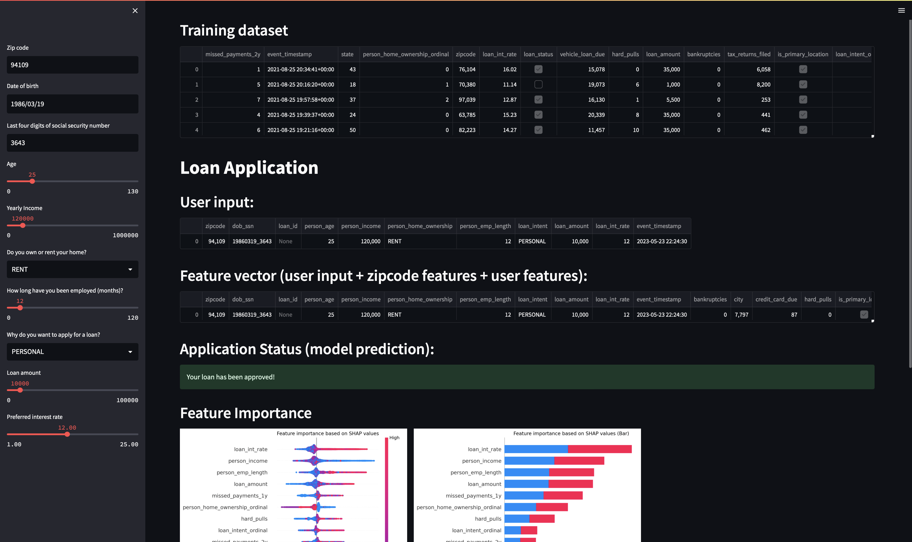

# Loan Model

This is an example of how you could use the `credit_scoring` model and combine it in a trainable model, training "pipeline" (in a notebook), and a streamlit application.

**NB!** The streamlit application is a bit buggy, since it struggels with `asyncio`


## Train a model

To train the model, run the whole Notebook throuh.
This will also add features to a online source, which is exptected to be a Redis instance at `redis://localhost:6379`.
However, this can be changed by setting the `REDIS_URL` env var. (can use a `.env` file in the root folder)

## Start the Streamlit app

Now you can run the Streamlit app!

This needs to be run from the root folder with the following command.

```python
python -m streamlit run loan_example/loan_streamlit.py 
```

